##Linux服务器搭建.md
### [LVM管理](#lvm) 
1.  [LVM简介](#lvm_intro)
2.  [LVM基本术语](#lvm_basic)
3.  [LVM安装](#lvm_install)
4.  创建和管理LVM
    - [创建LVM分区](#lvm_create)
    - [创建PV](#pv_create)
    - [创建VG](#vg_create)
    - [创建LV](#lv_create)
    - [LV格式化及挂载](#lv_mount)

------------------------------

<h3 id="lvm">LVM管理</h3>
<h4 id="lvm_intro">1. LVM简介</h4>  
LVM是 Logical Volume Manager(逻辑卷管理)的简写，它由Heinz Mauelshagen在Linux 2.4内核上实现。LVM将一个或多个硬盘的分区在逻辑上集合，相当于一个大硬盘来使用，当硬盘的空间不够使用的时候，可以继续将其它的硬盘的分区加入其中，这样可以实现磁盘空间的动态管理，相对于普通的磁盘分区有很大的灵活性。

与传统的磁盘与分区相比，LVM为计算机提供了更高层次的磁盘存储。它使系统管理员可以更方便的为应用与用户分配存储空间。在LVM管理下的存储卷可以按需要随时改变大小与移除(可能需对文件系统工具进行升级)。LVM也允许按用户组对存储卷进行管理，允许管理员用更直观的名称(如"sales'、 'development')代替物理磁盘名(如'sda'、'sdb')来标识存储卷。
如图所示LVM模型：

![LVM模型][../data/lvm_model.png] 

<h4 id="lvm_basic">2. LVM基本术语</h4>
LVM是在磁盘分区和文件系统之间添加的一个逻辑层，LVM为文件系统屏蔽下层磁盘分区布局，提供一个抽象的盘卷，在盘卷上建立文件系统。现在我们来学习以下几个LVM术语：

  - 物理存储介质（The physical media）：这里指系统的存储设备：硬盘，如：/dev/hda1、/dev/sda等等，是存储系统最低层的存储单元。

  - 物理卷（physical volume）：物理卷就是指硬盘分区或从逻辑上与磁盘分区具有同样功能的设备(如RAID)，是LVM的基本存储逻辑块，但和基本的物理存储介质（如分区、磁盘等）比较，却包含有与LVM相关的管理参数，简称PV。

  - 卷组（Volume Group）：LVM卷组类似于非LVM系统中的物理硬盘，其由物理卷（PV）组成。可以在卷组上创建一个或多个“LVM分区”（逻辑卷），LVM卷组由一个或多个物理卷组成，简称VG。

  - 逻辑卷（logical volume）：LVM的逻辑卷类似于非LVM系统中的硬盘分区，在逻辑卷之上可以建立文件系统(比如/home或者/usr等)，简称LV。

  - PE（physical extent）：每一个物理卷被划分为称为PE(Physical Extents)的基本单元，具有唯一编号的PE是可以被LVM寻址的最小单元。PE的大小是可配置的，默认为4MB。

  - LE（logical extent）：逻辑卷也被划分为被称为LE(Logical Extents) 的可被寻址的基本单位。在同一个卷组中，LE的大小和PE是相同的，并且一一对应。

简单来说就是：  

PV:是物理的磁盘分区  
VG:LVM中的物理的磁盘分区；VG是由PV组成的，可以将VG理解为一个仓库或者是几个大的硬盘。  
LV：也就是从VG中划分的逻辑分区  
如下图所示PV、VG、LV三者关系：  
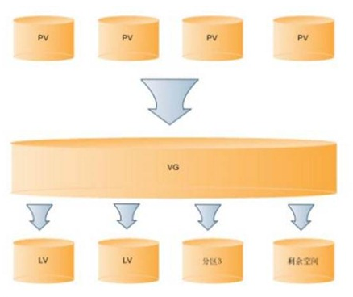

<h4 id="lvm_install">3. LVM安装</h4>
首先确定系统中是否安装了lvm工具：  
在root用户下执行：  
`
which lvm
`  
显示结果为  
`  /sbin/lvm
`  
如果命令结果输入类似于上例，那么说明系统已经安装了LVM管理工具；如果命令没有输出则说明没有安装LVM管理工具，则需要从网络下载或者从光盘装LVM rpm工具包。

<h4 id="lvm_install">4. 创建和管理LVM</h4>
<h5 id="lvm_create">创建LVM分区</h5>
使用分区工具（如：fdisk等）创建LVM分区，方法和创建其他一般分区的方式是一样的，区别仅仅是LVM的分区类型为8e。如下列图所示：  
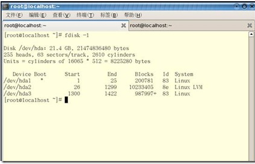  
查看磁盘分区列表：
`
fdisk /dev/sda3(设备文件的绝对路径)
`  
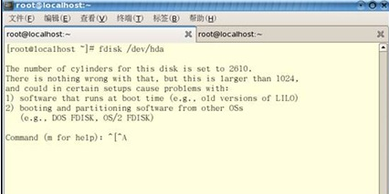   
使用fdisk创建分区，根据设备文件的绝对路径（/dev/sda3）进入分区管理  
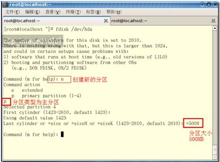  
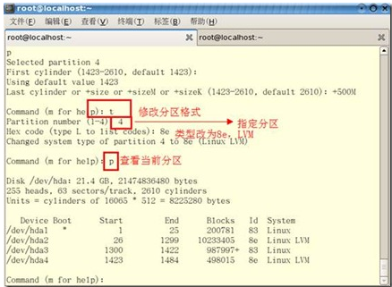  
**一定要指定分区的格式为8e，这是LVM的分区格式**  
<h5 id="pv_create">创建PV</h5>
创建PV  
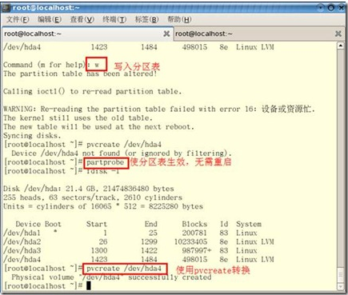
<h5 id="vg_create">创建VG</h5>
创建VG  
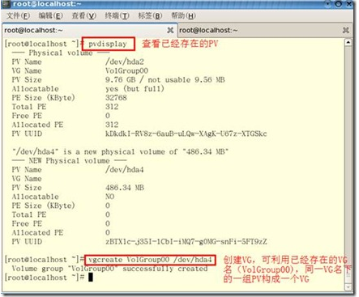  
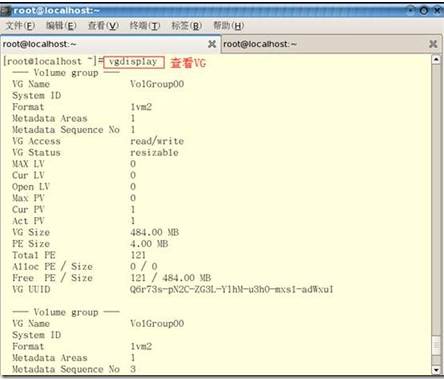  
<h5 id="lv_create">创建LV</h5>
创建LV  
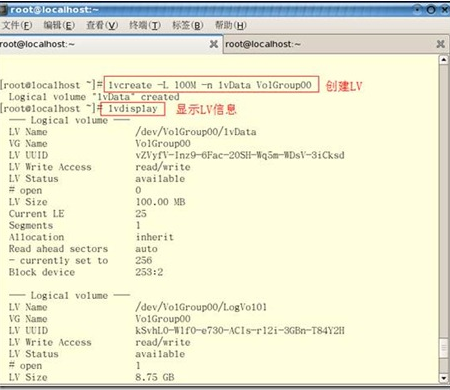  
创建完VG之后，才能从VG中划分LV。
<h5 id="lv_mount">LV格式化及挂载</h5>
下一步需要对LV进行格式化（使用mksf进行格式化操作），然后LV才能存储资料  
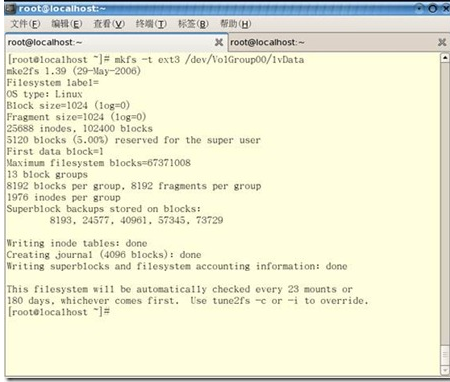  
将格式化后的LV分区挂载到指定的目录下，就可以像普通目录一样存储数据了  
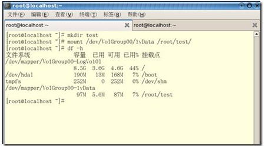  
挂载之后，可以看到此LV的容量。

如果要在系统启动的时候启动LV，最好是将mount命令写入/etc/rc.local文件中，如下所示： 
```
mount /dev/VolGroup/db2tbsp_lv  /db2tbsp
mount /dev/VolGroup/db2inst_lv  /db2inst
mount /dev/VolGroup/db2auto_lv  /db2auto
mount /dev/VolGroup/db2plog_lv  /db2plog

```
